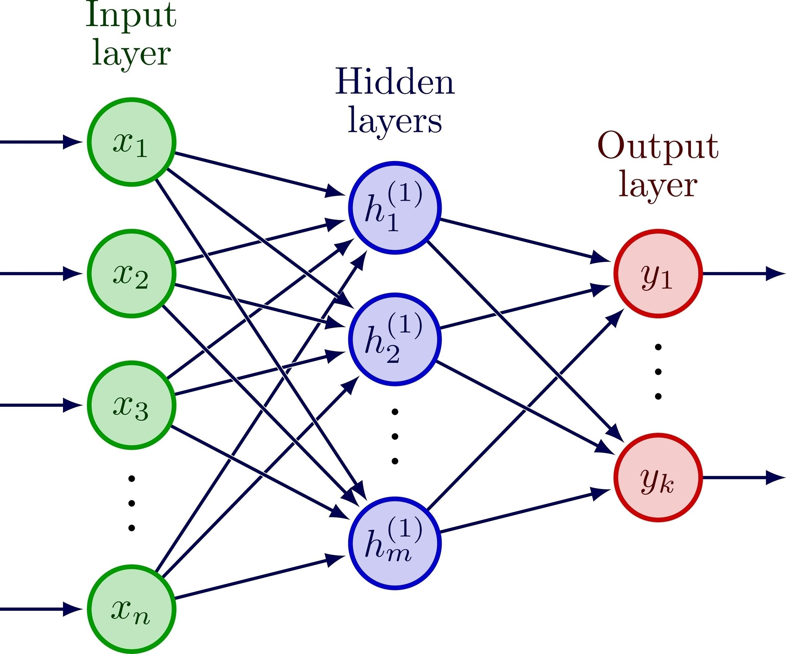

# FUNSR: 3D Lung Nodule Reconstruction via Implicit Neural Representations
Dự án này triển khai thuật toán tái tạo bề mặt 3D cho các nốt phổi từ dữ liệu Point Cloud thưa thớt, sử dụng phương pháp Implicit Neural Representations (INR). 
Mô hình có khả năng tái tạo bề mặt trơn mượt, độ phân giải vô hạn và sửa chữa các phần bị khuyết thiếu của dữ liệu gốc.

## 📑 Mục lục
Cài đặt (Installation)

Quy trình xử lý dữ liệu (Preprocessing)

Hướng dẫn sử dụng (Usage)

Nguyên lý hoạt động (How it works)

Hàm Loss & Metrics

Cấu trúc thư mục

## Cài đặt và training
1. Dự án yêu cầu Python 3.8+ và GPU hỗ trợ CUDA (Khuyến nghị T4, RTX 3060 trở lên).

```bash
    # 1. Clone repo
    git clone https://github.com/username/project-name.git
    cd project-name
    
    # 2. Cài đặt thư viện
    pip install -r requirements.txt
```
2. Preprocessing

```bash
    python preprocess.py
```

3. Training

```bash
    python train.py --mode val --workers 1
```

4. Inference

```bash
    python inference.py
```
Để xem thử file obj nếu không tải về:
```bash
    python app.py
```

## Quy trình xử lý dữ liệu
Trước khi đưa vào mô hình, dữ liệu nốt phổi cần trải qua các bước chuẩn hóa quan trọng.
### Bước 1: Trích xuất & Đồng thuận
Dữ liệu gốc: Bộ dữ liệu LIDC-IDRI bao gồm ảnh CT scan và các file XML chứa contours của 4 bác sĩ chẩn đoán hình ảnh khác nhau.
Nhưng các bác sĩ thường vẽ không giống nhau hoàn toàn. Nên chúng ta sử dụng 50% Consensus Voting. Tức là một voxel chỉ được coi là thuộc về nốt phổi nếu có ít nhất 2 trên 4 bác sĩ đồng ý đánh dấu nó.
=> Kết quả tạo ra một 3D Binary Mask thống nhất.
### Bước 2: Isotropic Resampling
Ảnh CT thường có độ phân giải không đồng đều, khiến nốt phổi bị bẹp và méo. Nên tác giả đề xuất sử dụng Spline Interpolation để đưa toàn bộ dữ liệu về độ phân giải đẳng hướng $1mm \times 1mm \times 1mm$
=> Đảm bảo hình dạng nốt phổi được bảo toàn đúng tỉ lệ thực tế.
### Bước 3: Surface Generation
Ở đây chúng ta sẽ chuyển đổi từ mask binary sang dạng 3D Mesh để lấy mẫu điểm.
Marching Cubes sẽ quét qua các voxel. Nếu một voxel nằm ở biên giới giữa nốt phổi và không khí, nó sẽ tạo ra các tam giác để nối bề mặt đó lại.
Kết quả là một 3D Mesh liền mạch bao quanh nốt phổi.
### Bước 4: Point Sampling
- Thuật toán: Uniform Surface Sampling.
- Từ bề mặt Mesh ở Bước 3, chúng ta rải ngẫu nhiên $N$ điểm sao cho mật độ điểm đồng đều trên toàn bộ bề mặt.
=> Ground Truth ($P_{gt}$) mà mạng sẽ học.
### Bước 5: Spatial Normalization
Mạng nơ-ron học rất tệ nếu tọa độ quá lớn. Chúng ta cần đưa về không gian đơn vị $[-1, 1]$.

$$p_{norm} = \frac{p_{original} - \text{center}}{\text{scale}}$$

- Centering: Tìm trọng tâm của nốt phổi và dời nó về gốc tọa độ $(0,0,0)$.

- Scaling: Tìm điểm xa nhất tính từ tâm. Chia tất cả tọa độ cho $r_{max} \times 1.1$ để nốt phổi nằm trong hình cầu bán kính 1, có một chút lề an toàn.

## Nguyên lý hoạt động: Implicit Neural Representations

Thay vì lưu trữ nốt phổi dưới dạng Mesh tốn bộ nhớ và bị giới hạn độ phân giải, FUNSR sử dụng phương pháp Implicit Representation.

1. Hàm ký hiệu khoảng cách SDF

Mô hình học một hàm liên tục $f(x, y, z) = s$.

- Nếu $s = 0$: Điểm đó nằm chính xác trên bề mặt phổi.

- Nếu $s < 0$: Điểm đó nằm bên trong khối u.

- Nếu $s > 0$: Điểm đó nằm bên ngoài.

2. Cơ chế Neural Pull

Giúp mạng học được SDF mà không cần biết trước SDF thật (Unsupervised).


- Input: Mạng lấy một điểm ngẫu nhiên $q$ gần bề mặt.

- Forward: Mạng dự đoán giá trị SDF $s$ và Gradient $g$ tại điểm đó.

- Operation: Mạng dùng chính Gradient vừa tính được để kéo điểm $q$ di chuyển ngược về phía bề mặt.

- Công thức kéo: $q_{new} = q - s \times \frac{g}{|g|}$

- Objective: Sau khi kéo xong, nếu $q_{new}$ trùng khít với điểm dữ liệu thật $p$, nghĩa là mạng đã đoán đúng. Nếu lệch, mạng phải tự sửa trọng số.

## Hàm Loss & Metrics
1. Các thành phần hàm Loss
Mạng được tối ưu hóa dựa trên tổng của 3 sai số:

- Square Error Loss ($L_{self}$): Đo khoảng cách giữa điểm đã được kéo ($q_{pulled}$) và điểm dữ liệu thật ($p$).

- Surface Consistency Loss ($L_{scc}$): Một ràng buộc hình học, ép buộc các vector pháp tuyến phải thay đổi mượt mà, tránh việc bề mặt bị gồ ghề hoặc gấp khúc vô lý.

- Adversarial Loss ($L_{gan}$): Sử dụng cơ chế GAN. Một mạng Discriminator sẽ soi xét xem bề mặt do mạng tạo ra có đủ độ chi tiết và tự nhiên như thật hay không.

2. Các chỉ số đánh giá

Để đánh giá chất lượng tái tạo một cách khách quan, chúng ta so sánh tập điểm dự đoán $P$ (Prediction) và tập điểm thực tế $G$ (Ground Truth).

a. Chamfer Distance (CD)

Đo độ sai lệch trung bình bình phương giữa bề mặt dự đoán và thực tế. Nó đánh giá cả hai chiều: từ dự đoán đến thực tế và ngược lại.

$$CD(P, G) = \frac{1}{|P|} \sum_{p \in P} \min_{g \in G} ||p - g||_2^2 + \frac{1}{|G|} \sum_{g \in G} \min_{p \in P} ||g - p||_2^2$$

Đơn vị: Thường nhân với $1000$ để dễ đọc. Giá trị càng nhỏ càng tốt.

b. Hausdorff Distance (HD)

- Đo khoảng cách xa nhất của điểm sai nhất.

$$HD(P, G) = \max \left\{ 
\max_{p \in P} \min_{g \in G} ||p - g||,
\max_{g \in G} \min_{p \in P} ||g - p|| 
\right\}$$

- Chỉ số này cực kỳ quan trọng trong y tế, vì nó cho biết biên giới khối u bị lệch tối đa bao nhiêu mm. Nó đảm bảo không có phần nào của khối u bị bỏ sót hoặc mô lành bị xâm lấn quá mức.

c. F-Score

Đo độ chính xác bao phủ dựa trên một ngưỡng sai số cho phép $\tau$.

Đầu tiên, ta tính Precision và Recall:

$$Precision(\tau) = \frac{1}{|P|} \sum_{p \in P} \mathbb{I}(\min_{g \in G} ||p - g|| < \tau)$$

$$Recall(\tau) = \frac{1}{|G|} \sum_{g \in G} \mathbb{I}(\min_{p \in P} ||g - p|| < \tau)$$

(Trong đó $\mathbb{I}$ là hàm chỉ thị: bằng 1 nếu điều kiện đúng, bằng 0 nếu sai)

Sau đó, F-Score là trung bình điều hòa của cả hai:

$$F\text{-}Score(\tau) = \frac{2 \cdot Precision(\tau) \cdot Recall(\tau)}{Precision(\tau) + Recall(\tau)}$$

=> Loại bỏ ảnh hưởng của các điểm nhiễu (outliers) nằm quá xa mà Chamfer Distance thường bị ảnh hưởng. Phản ánh đúng cảm nhận thị giác của con người.

#### Tác giả: Tuấn Anh, HCMUT